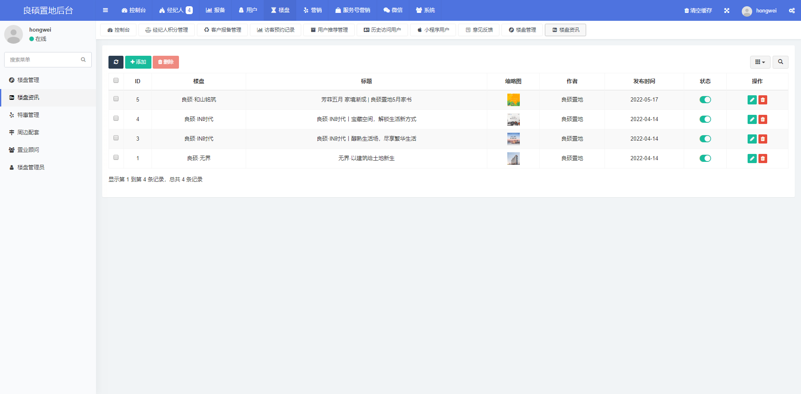
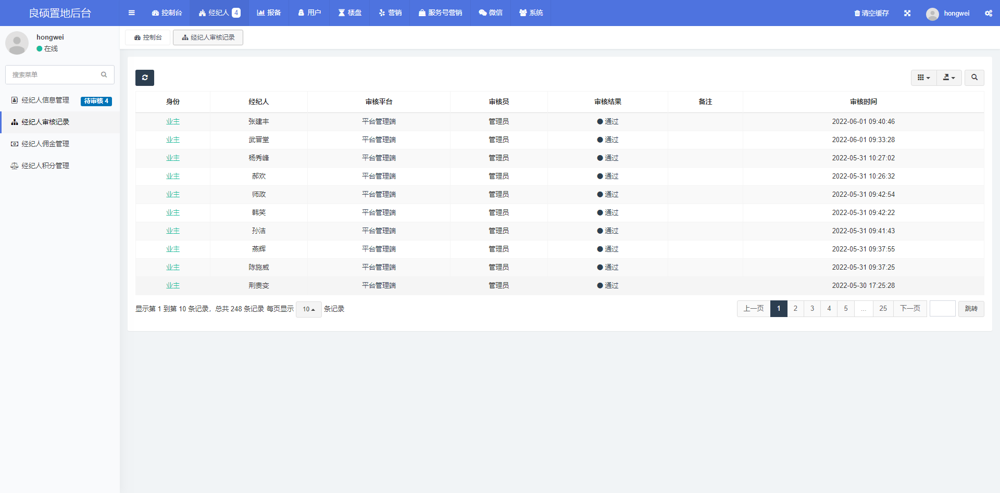
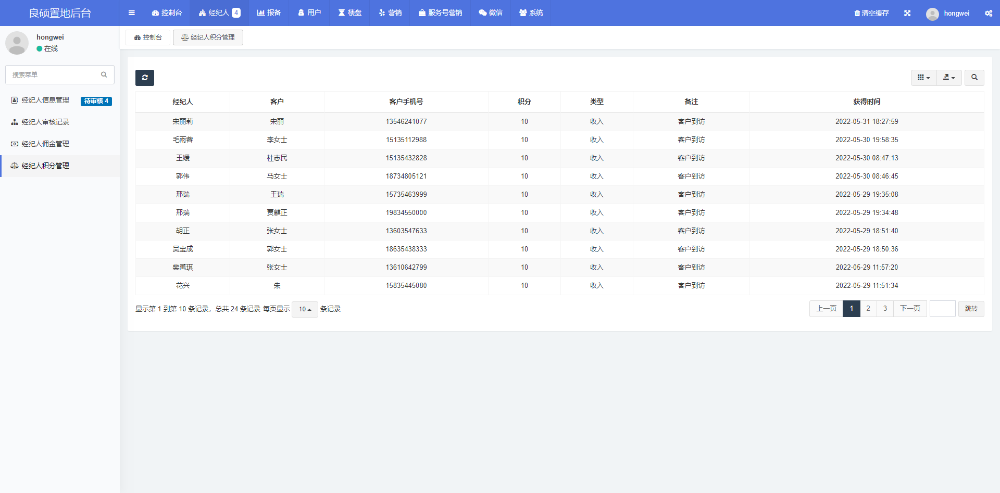
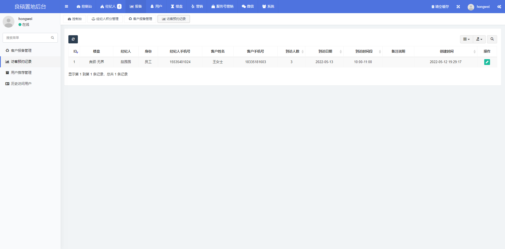

# 会员管理系统

#### 一、介绍

房地产经纪人管理系统是一种专门设计用于帮助房地产经纪人和房地产经纪公司管理其业务的软件系统。该系统提供了一系列功能和工具，旨在简化和优化经纪人的日常工作流程，提高效率，并提供更好的客户服务。

以下是一些常见的功能和特点，可以在房地产经纪人管理系统中找到：

客户管理：系统允许经纪人记录和管理他们的客户信息，包括联系方式、偏好、需求和备注。这有助于经纪人跟踪和管理潜在买家和卖家，以便提供个性化的服务。

房地产属性列表：经纪人可以在系统中创建和管理属性列表，包括详细信息、照片、定价和位置等。这样可以更轻松地展示和推广可用的房地产，并与潜在客户分享相关信息。

销售跟踪：系统可跟踪每个属性的销售进度，包括潜在买家的兴趣、报价和成交状态。这有助于经纪人了解市场趋势，并做出适当的决策。

报告和分析：系统可以生成各种报告和分析，例如销售统计、市场趋势、客户反馈等。这些数据可以帮助经纪人评估业务绩效，并制定策略以提高销售效果。

营销工具：系统通常提供各种营销工具，如电子邮件模板、社交媒体集成和广告管理等。这些工具可以帮助经纪人有效地宣传房地产、与客户进行沟通，并扩大业务影响力。

团队协作：对于房地产经纪公司而言，系统可以支持团队协作，允许经纪人共享信息、分配任务和协调工作。这样可以提高团队的合作效率和协同能力。

总之，房地产经纪人管理系统是一个功能强大的工具，帮助经纪人更好地管理他们的业务，并提供卓越的客户服务。它提供了多种功能，包括客户管理、 房地产属性列表、销售跟踪、报告和分析、营销工具以及团队协作等，旨在提高经纪人的效率和业务成果。

#### 二、技术选型

1. HTML + CSS + JavaScript
2. 微信小程序原生开发
3. PHP7.4
4. MySQL5.7
5. Redis
6. Nginx
7. 等……

#### 三、实现功能

##### 管理端
1. 经纪人
- 经纪人信息管理
- 经纪人审核记录
- 经纪人佣金管理
- 经纪人积分管理

2. 报备
- 客户报备管理
- 访客预约记录
- 用户推荐管理
- 历史访问用户

3. 用户
- 小程序用户
- 意见反馈

4. 楼盘
- 楼盘管理
- 楼盘咨询
- 特惠管理
- 周边配套
- 置业顾问
- 楼盘角色组
- 楼盘管理员

5. 营销
- 优惠券
- 领取记录

6. 服务号营销

- 会员（服务号）
  - 会员管理
- 大转盘
  - 大转盘奖品
  - 中奖记录
- 故事
- 答题
  - 答题海报
    - 海报列表
    - 海报记录管理
  - 答题类型
  - 试题管理
- 投标
  - 行业管理
  - 选手管理
  - 投票记录

7. 微信
- 菜单管理

8. 系统
- 轮播图管理
- 文章协议
- 常规管理
- 管理员管理
- 管理员日志
- 角色组

9. 运维
- 菜单规则
- 插件管理
- 在线命令管理

##### 楼盘管理端

1. 报备
2. 经纪人
3. 楼盘
4. 系统

##### 小程序端

1. 首页
- 地图找房
- 立即推荐
- 预约到访
- 楼盘咨询
- 经纪人认证
- 房贷计算器
- 精品楼盘

2. 无界
- 预约参观
- 一键导航
  
3. 我的
- 我的服务
  - 经纪人注册
  - 我的推荐
  - 我的预约
  - 我的收藏
- 优惠券
- 联系客户
- 完善信息
- 意见反馈

#### 四、系统平台功能导图

##### 管理端

##### 楼盘管理端

##### 小程序端

需要的联系，低价出售，私信联系我！！

系统、游戏、运维、技术支持均可联系！！

